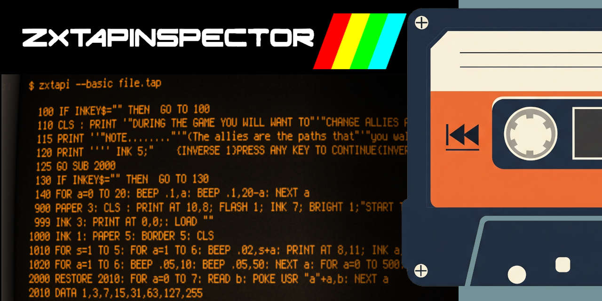

<div align="center">

# ZXTapInspector
[](#)
[](#)
[](#)
[](#)  

</div>

**ZXTapInspector** is a command-line tool written entirely in C for inspecting ZX-Spectrum ".tap" files. This utility lets you list blocks, view their contents, display the first BASIC program, and even extract each block into separate files using standard compatible formats.

## Features
- **Block Listing:**  
  Displays all blocks contained in a TAP file `(-l/--list)`.

- **Block Printing:**  
  Prints the contents of a specific block by specifying its index or colon-prefixed name `(-p/--print)`.

- **BASIC Code Output:**  
  Displays the first BASIC program found in the TAP file as untokenized text `(-b/--basic)`.

- **Binary Data Output:**  
  Displays the first binary code block found in the TAP file in Intel HEX format `(-c/--code)`.

- **Extraction:**  
  Extracts all blocks from the TAP file into separate files `(-x/--extract)`:
  - BASIC programs are saved as untokenized ".bas" text files.
  - Binary code is converted to Intel HEX format.
  - The extracted files are stored in a folder named after the original TAP file.


## Installation
To compile ZXTapInspector you only need Git and a C compiler installed on your system.  
(if you don’t have these tools set up yet, please refer to [SETUP.md](SETUP.md) for detailed step‐by‐step instructions)

**Clone the Repository**  
First, clone the repository from GitHub using the following command:
```
git clone https://github.com/martin-rizzo/ZXTapInspector.git
cd ZXTapInspector
```

**To Compile the Project on Windows** (using MSVC)  
```
cl /EHsc zxtapi.c
```

**To Compile the Project on Linux** (using gcc)  
```
gcc -o zxtapi zxtapi.c
```

**To Compile the Project on macOS** (using clang)  
```
clang -o zxtapi zxtapi.c
```


## Usage
Once compiled, run the tool from the command line:

```
$ ./zxtapi [OPTIONS] FILE.tap
```


## Project History
ZXTapInspector began as a simple script for extracting binary data from ZX Spectrum .tap files. Over time, more functionality was added and the concept evolved into a comprehensive tool for inspecting and processing tapes in .tap format.

## Contributions
This project is open source and contributions are welcome. If you find any bugs or wish to improve the functionality, do not hesitate to submit a pull request!

## License
Copyright (c) 2025 Martin Rizzo  
This project is licensed under the MIT license.  
See the ["LICENSE"](LICENSE) file for details.
